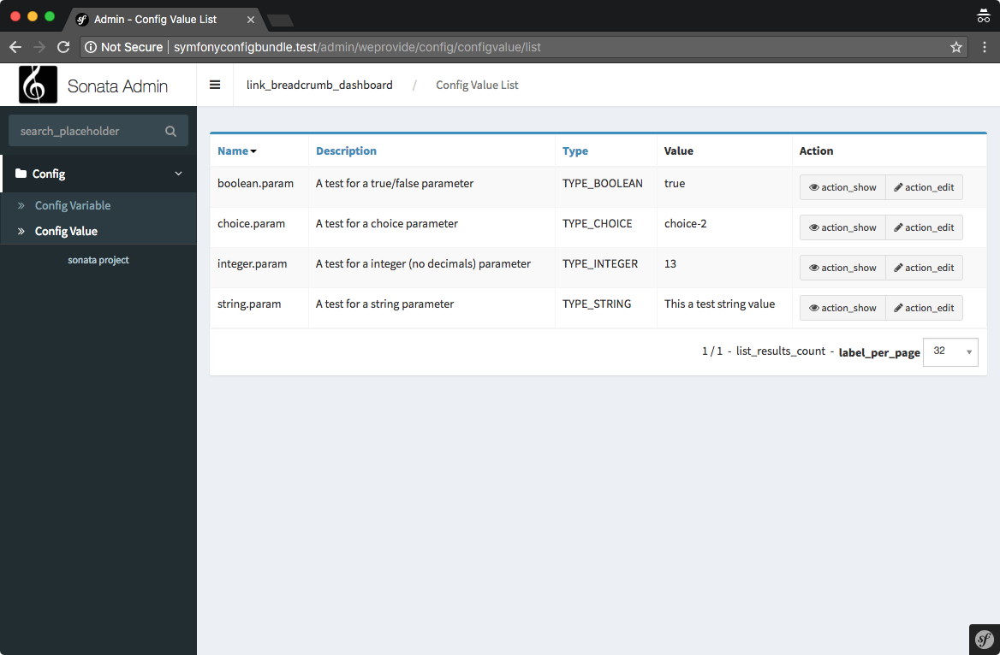

# We Provide Config Bundle

The We Provide Config Bundle for Symfony adds an interface into the Sonata/AdminBundle in which you can configure application parameters. 

Your Symfony application has a dozen of config values and parameters set in your `app/config` folder, spread in different (or one) `yml` files. If you need to be able to change the value of these configs at runtime without manually editing these files you can use We Provide's Config Bundle.

Let's for example say that you want to enable or disable a maintenance mode. You can do this now without having to log into your server, change the yml file and clear the cache, simply by changing the value with We Provide's Config Bundle.





In the image shown above you'll see a couple of parameters configured with the interface. This will output a `parameters.yml` which looks like below.

```yaml
parameters:
    boolean.param: true
    integer.param: 13
    string.param: 'This a test string value'
    choice.param: choice-2
```

You can use these parameters like you normally would in your Symfony application. Either in a controller with 
```
$this->getParameter('boolean.param');
```
or even in other parameters or config values with
```yaml
swiftmailer:
    delivery_addresses: '%string.param%'
```


## Dependencies

This bundle is developed with a Symfony Standard Edition on PHP 7.1 using We Provide's Valet+. Obviously it has dependencies to other projects and/or bundles. Below a list of dependencies, please use the installation guides of these bundles first.
 * [Symfony Standard Edition 3.3](https://symfony.com/doc/current/setup.html#creating-symfony-applications-with-composer)
 * [Sonata Admin Bundle 3.23](https://sonata-project.org/bundles/admin/3-x/doc/getting_started/installation.html) (with [SonataDoctrineORMAdminBundle](https://sonata-project.org/bundles/doctrine-orm-admin/master/doc/reference/installation.html))
 

## Installation

Install this bundle into your project using Composer.

```
composer require weprovide/symfony-config-bundle
```

Enable the bundle by inserting it in your Symfony's `AppKernel.php`.
```php
// app/AppKernel.php

// ...
class AppKernel extends Kernel
{
    public function registerBundles()
    {
        $bundles = array(
            // ...

            new WeProvide\ConfigBundle\WeProvideConfigBundle(),
        );

        // ...
    }

    // ...
}
```

Include the `config.yml` and `parameters.yml` into your own under the section `imports`. You can choose in which order you include these files, depending on where you want to use the parameters.
```yaml
imports:
    # ...
    - { resource: "@WeProvideConfigBundle/Resources/config/config.yml" }
    - { resource: "@WeProvideConfigBundle/Resources/config/parameters.yml", ignore_errors: true }
``` 

Update your database schema with the doctrine command.
```
bin/console doctrine:schema:update --force
```


## License

This bundle has been released under the MIT license and open for improvements, please share your thoughts which will be much appreciated.


## Authors

- Mischa Braam ([@mischabraam](https://github.com/mischabraam))


## TODO's

- [ ] Add event listeners where the client application can hook onto.
- [ ] Add list type to be able to config an yml array.